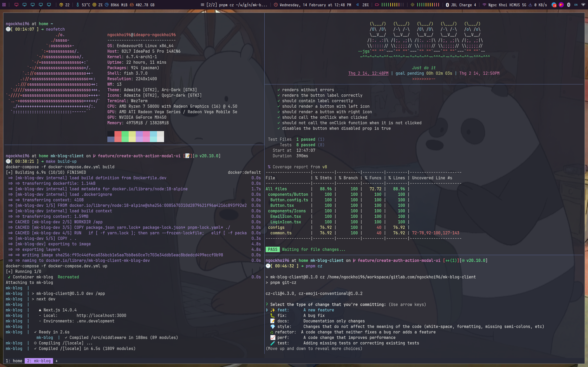
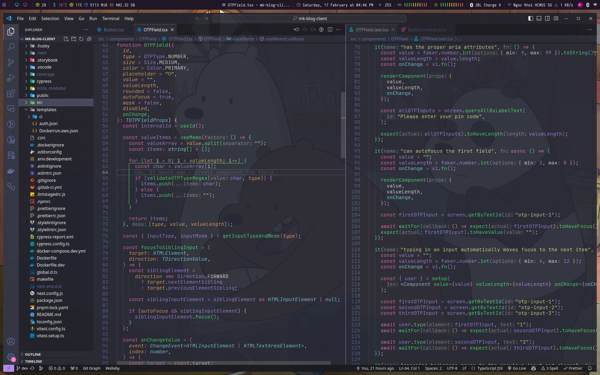
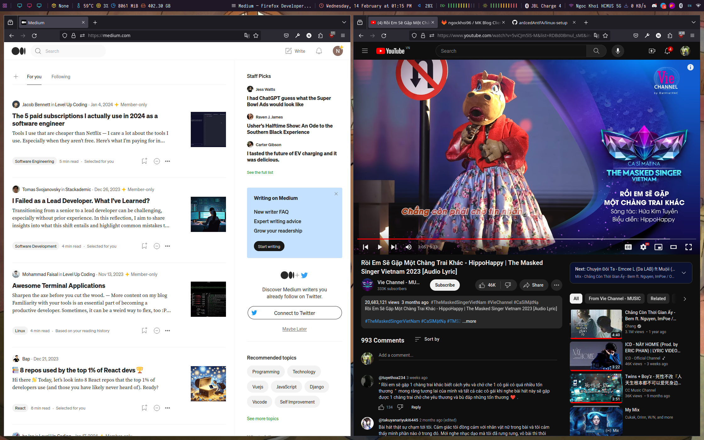
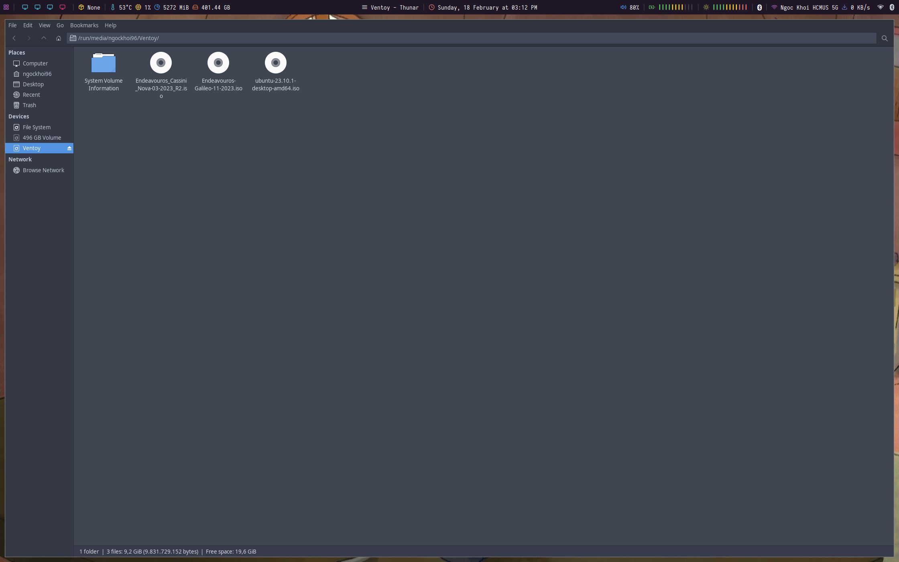
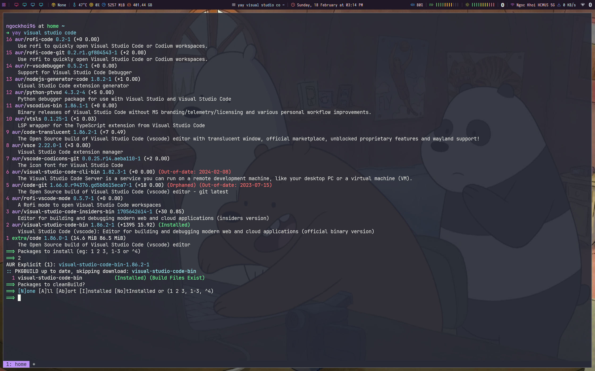

# Linux Setup







## Table of Contents

- [Linux Setup](#linux-setup)
  - [Table of Contents](#table-of-contents)
  - [Introduction](#introduction)
  - [Contents](#contents)
    - [Dependencies](#dependencies)
    - [i3 configs](#i3-configs)
    - [Shell configs](#shell-configs)
    - [Applications](#applications)
  - [User guide](#user-guide)
    - [Setup Docker](#setup-docker)
    - [Public Port](#public-port)
      - [1. Find Your Local IP Address](#1-find-your-local-ip-address)
      - [2. Configure firewalld to Allow Incoming Connections](#2-configure-firewalld-to-allow-incoming-connections)
  - [Credits](#credits)

## Introduction

✨ This is my Linux setup and _dotfiles_. **Feel free** to use it 🚀🚀🚀.

<br>

> [!WARNING]
>
> - This is the setting for my personal _laptop_. It may be different if used for a _PC_ or other devices.
> - **Be careful** when copy all settings unless you know what that entails, just read information **in detail** for each repository.

<br>

📝 Basically, I use:

<details>
  <summary>🪐 <a href="https://endeavouros.com/">EndeavourOS</a></summary>

- Download [ISO file](https://endeavouros.com/#Download).
- Dual boots with [Ventoy](https://github.com/ventoy/Ventoy).
  

</details>

<details>
  <summary>
    🤯 <a href="https://system76.com/cosmic/">Cosmic</a> - Desktop Environment.
  </summary>
</details>

<details>
  <summary>
  🛠️ <a href="https://github.com/Jguer/yay">yay</a> - Arch Linux AUR helper tool.
  </summary>

- With _yay_ you can easily install, update and manage your packages.
- Here is an example when using _yay_ to install VS Code.
  

</details>

<br />

🥳 Many thanks to my colleagues at **NDVN** for inspiring me and guiding me towards _Linux_. You guys are amazing and kind.

[`⬆ BACK TO TOP ⬆`](#table-of-contents)

## Contents

### Dependencies

```sh
yay -S [package-name]
```

Here is a list of packages:

`extra/wezterm` `tmux` `extra/neofetch` `extra/brightnessctl` `picom-git` `polybar` `fish` `extra/fisher` `git` `peco` `neovim` `eza` `starship` `htop` `redshift` `ttf-jetbrains-mono-nerd` `extra/noto-fonts-emoji` `nitrogen` `betterlockscreen` `flameshot` `visual-studio-code-bin` `jetbrains-toolbox` `docker` `docker-compose` `go` `i3lock-color` `arttime-git` `rofi-bluetooth-git` `extra/blueman` `network-dmenu-git` `appimagelauncher` `postman-bin` `firefox-developer-edition` `google-chrome` `microsoft-edge-dev-bin` `teams` `slack-desktop` `aur/prospect-mail` `extra/discord` `extra/telegram-desktop` `obsidian` `extra/calc` `aur/networkmanager-dmenu-git`

[`⬆ BACK TO TOP ⬆`](#table-of-contents)

### i3 configs

- [weztem](https://wezfurlong.org/wezterm/index.html) - A cross-platform terminal emulator and multiplexer.
- [betterlockscreen](https://github.com/betterlockscreen/betterlockscreen) - 🍀 sweet looking lockscreen for linux system

[`⬆ BACK TO TOP ⬆`](#table-of-contents)

### Shell configs

- [fish](https://github.com/fish-shell/fish-shell) - The user-friendly command line shell.
- [fisher](https://github.com/jorgebucaran/fisher) - A plugin manager for Fish.
- [dracula-fish](https://github.com/dracula/fish) - Dark theme for fish.
- [z for fish](https://github.com/jethrokuan/z) - Pure-fish z directory jumping.
- [ghq](https://github.com/x-motemen/ghq) - Remote repository management made easy.
- [peco](https://github.com/peco/peco) - Simplistic interactive filtering tool.
- [volta](https://volta.sh/) - The Hassle-Free JavaScript Tool Manager.
- [eza](https://github.com/eza-community/eza) - A modern, maintained replacement for ls.
- [starship](https://starship.rs/) - The minimal, blazing-fast, and infinitely customizable prompt for any shell!
- [go](https://go.dev/)
- [rust](https://www.rust-lang.org/)

[`⬆ BACK TO TOP ⬆`](#table-of-contents)

### Applications

## User guide

### Setup Docker

### Public Port

#### 1. Find Your Local IP Address

Other devices on your network will need your computer's local IP address.
Open your terminal and use either `ip a` or `ifconfig` (if you have `net-tools` installed):

```sh
ip a
```

Example output:

```sh
2: enp0s31f6: <BROADCAST,MULTICAST,UP,LOWER_UP> mtu 1500 qdisc fq_codel state UP group default qlen 1000
  link/ether aa:bb:cc:dd:ee:ff brd ff:ff:ff:ff:ff:ff
  inet 192.168.1.100/24 brd 192.168.1.255 scope global dynamic noprefixroute enp0s31f6
  valid_lft 86241sec preferred_lft 86241sec
```

In this example, your IP is `192.168.1.100`.

#### 2. Configure firewalld to Allow Incoming Connections

1. **Start and Enable `firewalld` service (if not already running):**
   First, confirm the `firewalld` service is running and enabled to start on boot:

   ```sh
   sudo systemctl status firewalld
   ```

   If it's not running or not enabled, use:

   ```sh
   sudo systemctl enable firewalld --now
   ```

2. **Determine your active zone:**
   `firewalld` uses zones to define trust levels. Common zones are `public`, `home`, `internal`.
   To see which zone your `enp4s0` interface is assigned to:

   ```sh
   sudo firewall-cmd --get-active-zones
   ```

   You will likely see `public` or home associated with your `enp4s0` interface. Let's assume it's `public` for the next steps.

3. **Add the port to your active zone:**
   You need to permanently add the port `5173` (TCP) to the zone your `enp4s0` interface is in. Replace `your-active-zone` with the actual zone name (e.g., `public`, `home`).

   ```sh
   sudo firewall-cmd --permanent --zone=your-active-zone --add-port=5173/tcp
   ```

   For example, if your active zone is `public`:

   ```sh
   sudo firewall-cmd --permanent --zone=public --add-port=5173/tcp
   ```

4. **Reload `firewalld` to apply changes:**

   ```sh
   sudo firewall-cmd --reload
   ```

5. **Verify the rule:**
   You can list the ports allowed in your zone to confirm the rule was added:

   ```sh
   sudo firewall-cmd --zone=your-active-zone --list-ports
   ```

   You should see `5173/tcp` in the output.

## Credits

This config has heavy inspiration from:

- [devaslife](https://github.com/craftzdog/dotfiles-public) - Takuya Matsuyama
- [mantran1611](https://github.com/manhtran1611/dotfiles) - Manh Tran
- [lazarus2019](https://github.com/lazarus2019) - Thai Son

[`⬆ BACK TO TOP ⬆`](#table-of-contents)
