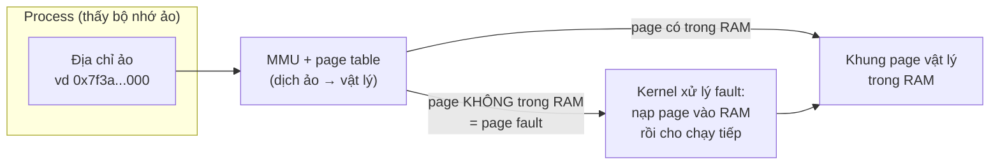
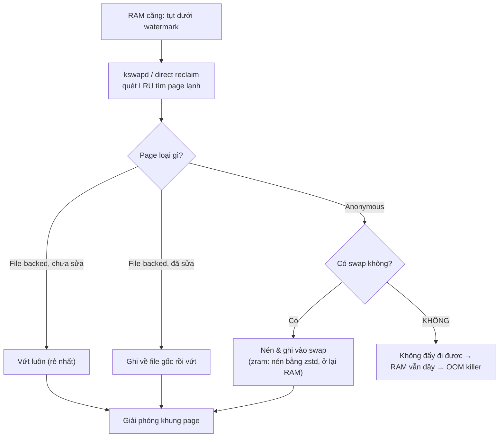
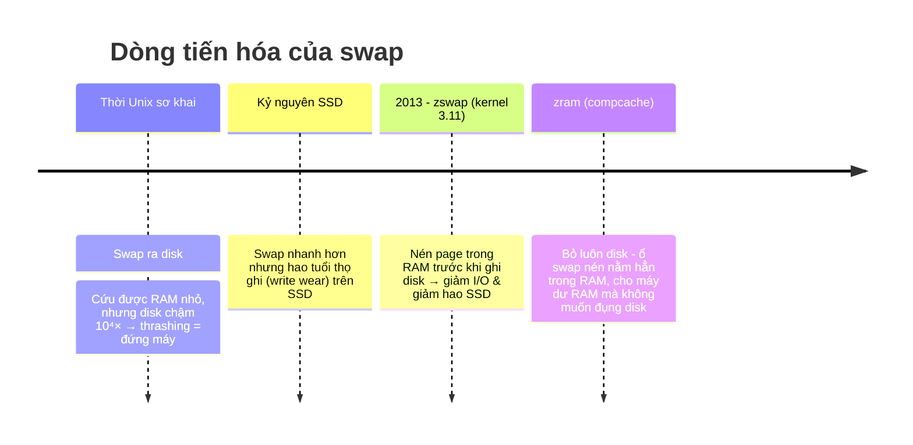
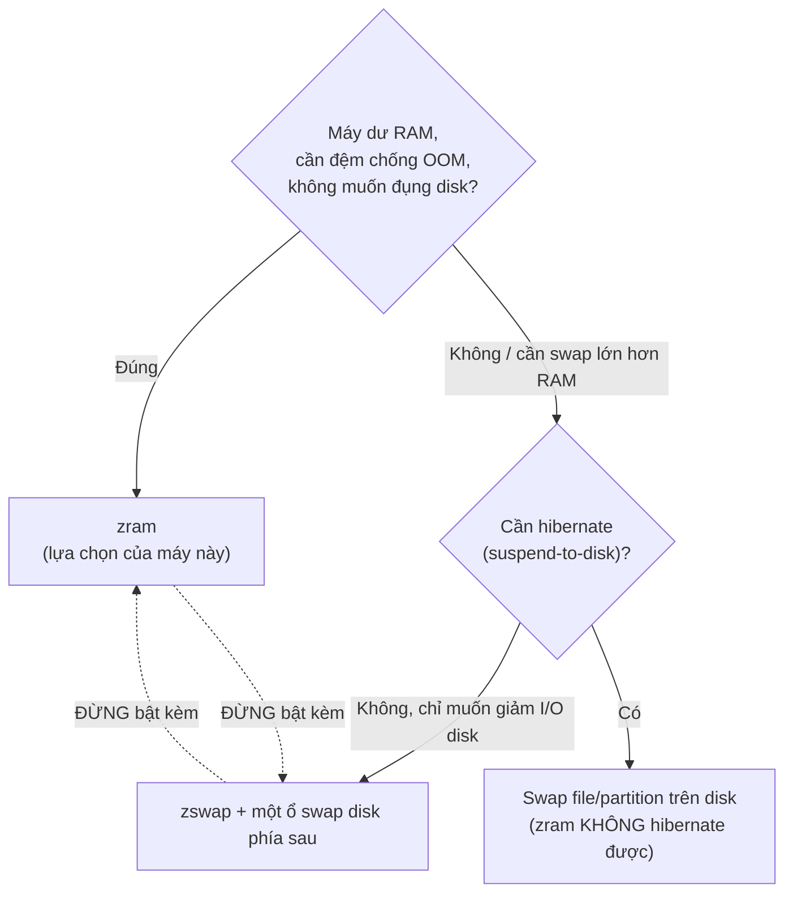

# Bộ nhớ, Swap, zram & zswap — hiểu từ gốc

> Tài liệu **lý thuyết**: giải thích _vì sao_ cơ chế swap/zram chạy được, ở mức
> RAM / CPU / paging / kernel. Nó **không** phải hướng dẫn cài đặt.
>
> - Cần **cài & vận hành** trên máy này → xem runbook [`zram.md`](zram.md).
> - Cần **lý do chọn** zram thay vì swapfile/capping → xem [ADR 0015](adr/0015-zram-swap-for-oom-resilience.md).
> - Cần **hiểu tại sao nó hoạt động** → bạn đang ở đúng chỗ.

---

## 1. TL;DR

- **RAM là tài nguyên hữu hạn; khi gần đầy, kernel phải "dọn" bớt page ra chỗ khác. Chỗ khác đó là _swap_.** Không có swap thì không có chỗ dọn → kernel giết process (OOM killer).
- **Có hai loại page.** _File-backed_ (đến từ file) có thể vứt đi rồi đọc lại. _Anonymous_ (heap, stack — do `malloc`) **không có nhà trên disk**, nên chỗ duy nhất để đẩy chúng đi là swap.
- **Máy này trước đây có 0 swap.** Nghĩa là anon page không bao giờ đẩy đi được → chỉ cần một spike là OOM killer bắn → Slack/Teams biến mất giữa phiên làm việc.
- **zram = một "ổ swap" nén, nằm ngay trong RAM.** Page lạnh được nén (~2–4× với zstd) thay vì bị giết. Đổi một cú OOM-kill cứng lấy một pha chậm-dần mềm mại.
- **Cú lừa `zswap`:** Arch bật sẵn `zswap` — một cache nén đặt _trước ổ swap disk_. Xếp chồng lên zram là **nén hai lần**, vô nghĩa. Đã tắt bằng `zswap.enabled=0`.
- **Payoff:** đệm chạy _vô hình_. Nhớ **hai ngưỡng, đừng gộp**: swap _chớm_ engage từ ~**24 GiB RAM-used** (kernel chủ động nén anon page lạnh — máy vẫn mượt, đây là _feature_ chứ không phải cảnh báo), còn ~**29–30 GiB** mới là mốc _khựng/OOM cũ_. Đo thật: đẩy tải đỉnh **28 GiB vẫn smooth**, swap giữ ~6 GiB nén còn **3.7×** — spike thành reclaim thay vì crash.

---

## 2. ELI5 (giải thích như cho trẻ con)

Tưởng tượng **bàn làm việc của bạn là RAM**. Nó nhanh vì mọi thứ trong tầm tay,
nhưng nhỏ. **Cái kho dưới nhà là ổ đĩa (disk)** — to mênh mông nhưng đi lấy đồ
rất lâu.

Khi bàn đầy giấy tờ, bạn có ba lựa chọn:

1. **Vứt bớt giấy mà bạn biết chắc in lại được** (đó là _file-backed page_ — bản gốc nằm trong file, cần thì đọc lại). Rẻ.
2. **Cất giấy viết tay xuống kho** (đó là _anonymous page_ — không có bản gốc ở đâu, nên bắt buộc phải _cất_, không được vứt). Đây là _swap_.
3. Nếu **không có kho** (0 swap) và giấy viết tay cứ chồng lên, tới lúc bàn hết chỗ, có người xông vào **đốt luôn cả tập tài liệu bạn đang làm** để lấy chỗ trống. Đó là **OOM killer**.

**zram** là một mẹo: thay vì mang giấy xuống kho xa (disk chậm), bạn mua một **máy
hút chân không để ngay trên bàn**. Giấy được ép mỏng lại (nén) và vẫn nằm trên
bàn, lấy ra tức thì. Mất một góc bàn cho cái máy, tốn chút sức ép giấy (CPU) —
nhưng không phải chạy xuống kho, và không ai đốt tài liệu của bạn nữa.

**zswap** là một cái máy hút chân không _thứ hai_, vốn thiết kế để dùng _trên
đường mang giấy xuống kho_. Nếu bạn đã có máy hút trên bàn (zram) mà lại bật thêm
cái này, bạn ép giấy hai lần vô ích. Nên tắt một cái đi.

---

## 3. Nền tảng: máy tính dùng bộ nhớ thế nào

Trước khi hiểu swap, phải hiểu cái _thứ bậc_ mà swap nằm ở đáy.

### 3.1 Memory hierarchy — cái thang tốc độ/dung lượng

Phần cứng lưu trữ xếp thành một cái thang: càng lên cao càng **nhanh** nhưng
**nhỏ và đắt**; càng xuống thấp càng **to rẻ** nhưng **chậm**.

```text
     NHANH, NHỎ, ĐẮT
┌──────────────────────────┐
│  CPU registers           │  ~1 chu kỳ      · vài KB
├──────────────────────────┤
│  L1 / L2 / L3 cache       │  ~1–40 chu kỳ   · KB → chục MB
├──────────────────────────┤
│  RAM (DRAM)               │  ~100 ns        · GB      ← "bộ nhớ" ta hay nói
├──────────────────────────┤
│  SWAP: zram (RAM nén)     │  ~µs (chỉ tốn CPU nén)    ← ổ swap của máy này
│  SWAP: SSD / NVMe         │  ~10–100 µs     · GB→TB
│  SWAP/lưu trữ: HDD        │  ~ms (chậm 10⁴×)· TB
└──────────────────────────┘
     CHẬM, TO, RẺ
```

Điểm mấu chốt: khoảng cách tốc độ giữa **RAM và disk** là _hàng chục nghìn lần_.
Đây là lý do vì sao "swap ra disk" mang tiếng chậm — và cũng là lý do vì sao
**zram** (swap mà vẫn nằm trong RAM) là một ý tưởng hay: nó cắt cái khoảng cách đó
xuống chỉ còn "chi phí nén bằng CPU".

### 3.2 Virtual memory & paging — ảo hóa bộ nhớ

Không process nào chạm thẳng vào RAM vật lý. Mỗi process thấy một **không gian địa
chỉ ảo (virtual address space)** riêng, như thể nó sở hữu cả máy. Một phần cứng
tên **MMU (Memory Management Unit)** trong CPU dịch địa chỉ ảo → địa chỉ vật lý,
tra qua bảng gọi là **page table**.

Bộ nhớ không quản lý theo từng byte mà theo **page** — khối cố định, thường
**4 KiB**. Mọi thao tác cấp phát/dọn dẹp đều tính bằng page.



**Page fault** = khi process truy cập một page hiện _không nằm trong RAM_. CPU
tạm dừng, nhường quyền cho kernel đi tìm page đó và nạp vào, rồi cho process chạy
tiếp — process không hề biết. Có hai mức:

- **Minor fault:** page thật ra vẫn trong RAM (vd trong _page cache_), chỉ chưa
  nối vào page table của process này. Rất rẻ.
- **Major fault:** page phải lấy từ **disk** (từ file, hoặc từ **swap**). Đắt —
  vì phải chờ I/O. Swap-in chính là một major fault.

### 3.3 Anonymous vs file-backed page — **khái niệm quan trọng nhất tài liệu này**

Mọi page trong RAM thuộc một trong hai loại, và sự khác biệt quyết định _swap tồn
tại để làm gì_:

|                      | **File-backed page**                                                                  | **Anonymous page**                                                               |
| -------------------- | ------------------------------------------------------------------------------------- | -------------------------------------------------------------------------------- |
| Đến từ đâu           | Nội dung của một file trên disk (code chương trình, thư viện, file bạn mở)            | Bộ nhớ do process tự cấp: heap (`malloc`), stack, biến                           |
| Có "nhà" trên disk?  | **Có** — chính cái file gốc                                                           | **Không** — chưa từng tồn tại ở đâu ngoài RAM                                    |
| Khi cần dọn khỏi RAM | Nếu chưa sửa: **vứt luôn**, cần thì đọc lại từ file. Nếu đã sửa: ghi về file rồi vứt. | **Không có chỗ để vứt** → phải ghi vào **swap**, nếu không thì kẹt mãi trong RAM |

Đây là mấu chốt:

> **Anonymous page chỉ có thể được đẩy khỏi RAM nếu có swap.** Không swap →
> chúng bị **ghim cứng** trong RAM cho tới khi process chết.

Suy ra hệ quả trực tiếp cho máy **0 swap**: khi RAM căng, kernel _chỉ_ có thể
reclaim file-backed page (vứt page cache). Nhưng heap của Electron, Node, browser
phần lớn là **anon**. Kernel vứt sạch file cache rồi mà anon vẫn phình → hết
đường lùi → **OOM killer**. Đó chính xác là điều đã xảy ra với Slack/Teams (xem §5).

---

## 4. "Swapping" thật ra là gì

_Swapping_ không phải một hành động một-phát. Nó là kết quả của **page reclaim** —
quá trình kernel giải phóng RAM khi bộ nhớ căng.

Kernel giữ các page trong **danh sách LRU** (Least Recently Used — ít dùng gần
đây nhất). Khi RAM tụt xuống dưới một ngưỡng (_watermark_), một tiến trình nền
tên **`kswapd`** thức dậy và quét từ đầu lạnh của LRU, đẩy các page lạnh đi. Nếu
bộ nhớ căng quá nhanh, chính process đang xin RAM phải tự dọn ngay tại chỗ
(**direct reclaim** — đây là lúc bạn _cảm thấy_ máy khựng).



**`swappiness`** là cái núm điều khiển _tỷ lệ ưu tiên_ giữa hai nhánh ở nhánh
chọn loại page: reclaim anon (→ swap) so với reclaim file cache. Nói kỹ ở §9.

**Thrashing** là mặt tối: khi _working set_ (tập page thực sự đang cần) lớn hơn
RAM, kernel vừa swap-out một page thì ngay sau đó process lại cần nó → swap-in →
lại phải swap-out page khác. Máy dành gần hết thời gian cho việc chuyển page thay
vì chạy việc thật. Với disk swap, thrashing = đứng máy. Với zram, do "swap" vẫn ở
RAM nên rẻ hơn nhiều — nhưng vẫn tốn CPU nén/giải nén, không phải bùa miễn phí.

---

## 5. Nỗi đau → vì sao các cơ chế này ra đời

Mỗi công nghệ ở đây sinh ra để chữa nỗi đau của cái trước nó.



- **Disk swap** giải quyết "RAM không đủ", nhưng disk chậm khủng khiếp → thrashing.
- **SSD** làm swap nhanh hơn nhiều, nhưng mỗi lần swap là một lần ghi → bào mòn ổ.
- **zswap (2013, Seth Jennings)** chèn một tầng nén trong RAM _trước_ ổ swap disk:
  page lạnh được nén và giữ lại RAM; chỉ khi pool nén đầy mới thực sự ghi xuống
  disk. Giảm cả I/O lẫn hao mòn SSD.
- **zram** đi xa hơn: nếu chỉ cần một cái đệm và không muốn đụng disk chút nào,
  hãy tạo hẳn một ổ swap _nén, sống trong RAM_. Không I/O disk, không hao ổ.

### Nỗi đau cụ thể trên máy này

Máy 31 GiB, workload thường trực ~18–25 GiB: mono-repo dev, vài container Docker,
Slack + Microsoft Teams (Electron), database client, API client (Bruno), Zed/VS
Code mở 3–4 project cùng lúc, và hàng chục tab Zen browser gồm Figma, Notion,
docs. Không có đệm swap, chỉ cần một container spike bộ nhớ là chạm trần:

```text
# 2026-08-11 15:47:21 — một container spike đẩy cả máy tới global OOM:
containerd invoked oom-killer: ... order=0, oom_score_adj=-999
oom-kill: ... global_oom ... task=slack,pid=16200,uid=1000
Out of memory: Killed process 16200 (slack)
  total-vm:1460098276kB, anon-rss:328452kB, ... oom_score_adj:300
```

Kernel chọn `slack` (mang `oom_score_adj:300` — bị thiên vị để giết trước, dù chỉ
chiếm ~320 MB anon-rss); hai phút sau `coredumpctl` ghi tiếp `teams-for-linux`
(SIGILL, 15:49:49) rồi `slack` (SIGTRAP) — cả hai cửa sổ biến mất giữa phiên,
không cảnh báo. Đó là nỗi đau khiến máy này thêm zram.

> **[!NOTE]** Trace thật ở trên lấy trên chính máy này bằng
> `journalctl -k | rg -i 'oom-killer|Killed process'` và
> `coredumpctl list | rg -i 'slack|teams'`. Đây là "before" đắt giá nhất của tài
> liệu — số giữ nguyên, không dựng lại.

---

## 6. Bốn thứ hay bị nhầm lẫn (phần lõi)

Đây là chỗ mọi người rối. Có **bốn** thứ, chia làm hai trục: _swap nằm ở đâu_ và
_có tầng nén không_.

| Cơ chế             | Bản chất                                        | Nằm ở đâu                    | Nén?            | Là "ổ swap" hay "cache"?                     |
| ------------------ | ----------------------------------------------- | ---------------------------- | --------------- | -------------------------------------------- |
| **Swap partition** | Một phân vùng disk riêng dành cho swap          | Disk                         | Không           | Là ổ swap                                    |
| **Swap file**      | Một _file_ swap trên filesystem sẵn có          | Disk                         | Không           | Là ổ swap                                    |
| **zram**           | Một **block device nén**, _chính nó_ là ổ swap  | **RAM**                      | Có (zstd/lz4/…) | **Là ổ swap**                                |
| **zswap**          | Một **cache nén** đặt **trước** một ổ swap disk | RAM (cache) + disk (backing) | Có              | **Là cache**, _cần_ một ổ swap thật phía sau |

Hai điểm hay nhầm nhất:

1. **zram vs zswap không phải hai tên của một thứ.**
   - **zram** _là_ ổ swap. Nó thay thế disk swap bằng RAM nén. Không cần gì phía sau.
   - **zswap** _không_ là ổ swap. Nó là một cache đứng chặn trước một ổ swap disk
     thật (partition/file). Không có ổ disk phía sau thì zswap không có nơi để
     "ghi tràn" khi pool đầy.

2. **swap partition vs swap file** khác nhau rất ít về hiệu năng trên hệ hiện đại
   — chỉ khác cách quản lý: partition cố định, file thì linh hoạt (đổi kích thước,
   thêm/bớt dễ). Cả hai đều **trên disk**, đều **không nén**.

### Chọn cái nào? (decision tree)



### Deep-dive: vì sao xếp chồng zswap lên zram là sai (đúng lỗi từng có trên máy này)

Arch ship kernel với `CONFIG_ZSWAP_DEFAULT_ON=y`, nên `zswap` _sống sẵn từ lúc
boot_ dù không ai yêu cầu (`/sys/module/zswap/parameters/enabled` đọc ra `Y`).
Nếu để nguyên khi đã dùng zram, chuỗi sự kiện thành:

```text
Page anon lạnh cần swap-out
        │
        ▼
   zswap chặn lại, NÉN (zstd) vào pool riêng trong RAM   ← lần nén 1
        │
   (pool zswap đầy) → zswap GIẢI NÉN page cũ nhất,
        │              rồi ghi "xuống ổ swap" — mà ổ đó là zram
        ▼
   zram nhận page, NÉN (zstd) lần nữa vào pool của nó     ← lần nén 2
```

Cả hai cùng nén vào RAM bằng zstd, nên zswap chẳng thêm giá trị gì — nó chỉ:

- **nén hai lần** (tốn CPU vô ích khi ghi tràn: giải nén rồi nén lại),
- **qua mặt** cái `zram-size` cap và thuật toán mà ta đã tinh chỉnh cho zram,
- khiến `zramctl` báo số khó hiểu vì phần lớn traffic bị zswap giữ.

Arch Wiki khuyến nghị chỉ dùng **một trong hai**, không cả hai. Vì `zswap` là
_builtin_ (biên dịch thẳng vào kernel, không phải module), không tắt được từ file
config hay modprobe — công tắc bền duy nhất là **kernel command line**. Trên máy
GRUB này: thêm `zswap.enabled=0` vào `GRUB_CMDLINE_LINUX_DEFAULT` rồi
`grub-mkconfig`. Chi tiết thao tác trong [`zram.md`](zram.md).

---

## 7. Bên trong zram

zram không "cấp phát 15,6 GiB RAM" ngay. Nó chỉ mượn RAM _theo lượng page thực sự
được swap vào_, và mượn ở dạng đã nén.

- **Thuật toán nén.** Máy này chọn `zstd` — cân bằng tốt giữa tỷ lệ nén và tốc độ
  trên CPU hiện đại. Các lựa chọn khác: `lzo`/`lzo-rle` (nhanh, nén nhẹ),
  `lz4`/`lz4hc`, `deflate`, `842`. Xem danh sách trên máy:
  `cat /sys/block/zram0/comp_algorithm` — cái trong `[ngoặc]` là đang dùng.
- **zsmalloc.** Bộ cấp phát chuyên dụng để nhét các khối nén _kích thước lẻ_ vào
  RAM với mật độ cao (page nén xong không còn tròn 4 KiB nữa).
- **Same-filled-page optimization.** Một page mà _toàn bộ_ là một byte lặp lại
  (điển hình: page toàn số 0) được lưu bằng một **marker tí hon**, không tốn chỗ
  cho dữ liệu. Đây là lý do các bài test bằng `/dev/zero` cho tỷ lệ nén "vô hạn"
  giả tạo (xem cảnh báo ở §11).

### Ba con số khác nhau — chỗ dễ hiểu sai nhất

Khi đọc `zramctl`, ba cột này _đo ba thứ khác nhau_:

| Cột     | Nghĩa                                                               |
| ------- | ------------------------------------------------------------------- |
| `DATA`  | Kích thước **chưa nén** của dữ liệu zram đang giữ                   |
| `COMPR` | Dữ liệu đó **sau khi nén**                                          |
| `TOTAL` | **RAM thật** zram tiêu để giữ chỗ đó (gồm cả overhead của zsmalloc) |

Và `swapon --show` lại đo thứ _thứ tư_:

| Cột             | Nghĩa                                                                                                                    |
| --------------- | ------------------------------------------------------------------------------------------------------------------------ |
| `USED` (swapon) | Lượng _không gian swap_ kernel coi là đã dùng (số page đã đẩy ra) — đây là con số **chưa nén**, nên luôn lớn hơn `TOTAL` |

> Nhớ: `swapon USED` = "kernel đã đẩy bao nhiêu page ra swap"; `zramctl TOTAL` =
> "việc đó _thực sự_ tốn bao nhiêu RAM". Chênh lệch giữa hai cái chính là phần
> nén tiết kiệm được.

---

## 8. OOM killer — vì sao 0 swap = tử hình sớm

Khi kernel cần RAM mà **không còn gì để reclaim** (file cache vứt hết, anon không
đẩy đi được), nó không thể trả về lỗi cho `malloc` giữa chừng một cách an toàn.
Giải pháp cuối: **OOM killer** — chọn một process để giết, lấy lại RAM.

- Mỗi process có một điểm **`oom_score`**, tính chủ yếu theo lượng RAM đang chiếm.
  Có thể chỉnh thiên vị bằng **`oom_score_adj`** (−1000 … +1000): giá trị âm =
  "đừng giết tôi", dương = "giết tôi trước".
- Kernel giết process **điểm cao nhất** — thường là app _to_ nhất, mà app to
  thường chính là thứ bạn đang dùng (browser, Electron chat).

Nối lại với §3.3: trên máy **0 swap**, anon page không đẩy đi được, nên "còn gì để
reclaim" cạn _rất nhanh_. OOM killer bắn sớm, và bắn trúng Slack/Teams. zram thêm
một **đệm mềm**: anon page lạnh có chỗ để nén vào, RAM được giải phóng dần, OOM
killer không phải ra tay. Một cú crash cứng biến thành một pha chậm-rồi-hồi.

> **Lưu ý honest:** zram _hoãn_ OOM chứ không _xóa_ nó. zram là RAM nén — vẫn tốn
> RAM. Nếu bạn thực sự cấp phát vượt xa cả (RAM + zram nén), OOM vẫn bắn. zram mua
> cho bạn thời gian và sự mượt, không phải bộ nhớ vô hạn.

---

## 9. Tinh chỉnh mô hình (tuning) — trình bày dạng _đánh đổi_, không phải "khuyến nghị"

Các núm dưới đây nằm trong [`etc/sysctl.d/99-zram.conf`](../etc/sysctl.d/99-zram.conf).
Chúng **chỉ hợp lý _vì_ swap là zram (RAM-fast)**; với swap disk thì phần lớn là
lựa chọn _tồi_. Đây là chỗ hiểu "vì sao", không phải chép giá trị.

### `vm.swappiness = 180` (mặc định 60)

Núm cân bằng: reclaim anon (→ swap) so với reclaim file cache. Range hiện đại là
**0–200** (từ kernel 5.8). Mặc định 60 giả định "swap chậm, tránh ra" — **sai với
zram**. Đặt 180 = "cứ mạnh dạn nén anon page lạnh vào zram thay vì vứt file cache
(vốn phải đọc lại từ disk)". Trade-off: nếu thuật toán nén và CPU yếu, swappiness
cao dồn thêm việc nén lên CPU.

Một cách trực giác từ Arch Wiki: nếu swap nhanh gấp _k_ lần filesystem thì
swappiness hợp lý ~ `200·k/(k+1)`. Với in-RAM swap, _k_ rất lớn → tiến gần 200.

### `vm.page-cluster = 0` (mặc định 3)

Swap **readahead**: mỗi lần swap-in, kernel đọc luôn `2^page_cluster` page lân cận
với hy vọng bạn cần chúng ngay. Với disk, đọc thừa vài page là đáng vì tiết kiệm
seek. Với **zram không có seek**, đọc thừa chỉ tổ _tốn CPU giải nén_ page bạn chưa
cần. `page-cluster = 0` → `2^0 = 1` page → **tắt readahead**. Đúng cho RAM swap.

### `vm.watermark_boost_factor = 0` (mặc định 15000)

Khi bộ nhớ _phân mảnh_, kernel tạm thời "boost" các watermark để reclaim mạnh hơn
nhằm dồn mảnh (compaction). Với swap nhanh, việc boost này dễ gây **over-reclaim
thrash** (dọn quá tay). Đặt 0 = tắt boost.

### `vm.watermark_scale_factor = 125` (mặc định ~10)

Khoảng cách giữa các ngưỡng watermark của `kswapd`. Cao hơn = kswapd **thức sớm
hơn, reclaim đều tay hơn**, nhường ít cơ hội cho direct reclaim (cái gây khựng).

> **[!WARNING] 125 là _khá cao_ (mặc định ~10).** Nó khiến máy reclaim sớm và
> chủ động — đánh đổi: dọn sớm có thể hơi phí công khi spike chỉ là nhất thời.
> Đây là **lựa chọn của mình cho workflow hay chạm trần**, không phải con số
> khuyến nghị phổ quát. Nếu viết blog, hãy trình bày như một tham số để người đọc
> tự cân, kèm cách đo (`vmstat 1` xem cột `si`/`so`, và tần suất direct reclaim).

---

## 10. Mặc định của các distro, ưu/nhược, yêu cầu

### Linux mỗi distro mặc định gì

| Distro                  | Swap mặc định                                               | zram?                           | zswap?                                    |
| ----------------------- | ----------------------------------------------------------- | ------------------------------- | ----------------------------------------- |
| **Arch / EndeavourOS**  | **Không có swap**                                           | Không (tự cài `zram-generator`) | **Bật sẵn** (`CONFIG_ZSWAP_DEFAULT_ON=y`) |
| **Fedora** (zram từ 33) | **zram** (qua `zram-generator`, `zram-size = min(ram, 8G)`) | **Có, sẵn**                     | Bật sẵn nhưng bị zram lấn                 |
| **Ubuntu**              | Swap **file** trên disk                                     | Không (tùy `zram-config`)       | Bật sẵn                                   |
| **openSUSE / Pop!_OS**  | Thường swap partition/file                                  | Tùy                             | Tùy                                       |

> Con số Fedora là default _hiện tại_ (Fedora ghi đè thành full-RAM, cap 8G).
> Bản thân `zram-generator` upstream mặc định khiêm tốn hơn — `min(ram/2, 4G)`.
> Máy này cũng lấy `ram/2`, nhưng cap 16G (chi tiết §12).

Điểm đáng nhớ cho máy này: **Arch cho bạn 0 swap nhưng lại bật zswap** — một cặp
bất đối xứng khó chịu, chính là cái bẫy đã gỡ ở §6.

### Ưu / nhược của zram

#### Ưu

- Nhanh cỡ RAM, không seek, không I/O disk.
- Không hao tuổi thọ ghi SSD.
- Không chiếm dung lượng disk.
- Biến OOM-kill cứng thành reclaim mềm.
- Cấu hình gọn (một systemd generator).

#### Nhược / giới hạn

- Tốn CPU cho nén/giải nén (rẻ với zstd, nhưng không free).
- Vẫn ăn RAM — chỉ là RAM _đã nén_; không phải bộ nhớ thêm thật sự.
- **Không hibernate được** (không giữ được ảnh suspend-to-disk).
- zram-only là _trần cứng_: khi đầy, không có tầng disk để tràn xuống, page lạnh
  kẹt lại và áp lực reclaim dồn hết lên file cache.

### Yêu cầu (requirements)

- Kernel có `CONFIG_ZRAM` (mọi kernel Arch/Fedora hiện đại đều có).
- Tiện nhất: gói **`zram-generator`** (máy này cài bằng `pacman`/`yay`, đã thêm
  vào `packages/pacman-explicit.txt`).
- Nếu dùng zram thì **tắt zswap** (`zswap.enabled=0` trên kernel cmdline).
- Muốn hibernate → cần thêm **swap disk thật** song song (hai cái sống chung được).

---

## 11. Tự quan sát: thấy mô hình chạy bằng chính mắt bạn

Lý thuyết chỉ dính khi bạn _nhìn nó động đậy_. Đây là các lệnh để **đọc** trạng
thái — không phải để cài (cài xem [`zram.md`](zram.md)).

### Ảnh chụp nhanh trạng thái

```sh
free -h            # tổng quan RAM + swap (đọc kỹ ở dưới)
swapon --show      # ổ swap nào đang sống, ưu tiên, đã dùng bao nhiêu
zramctl            # riêng zram: thuật toán, DATA/COMPR/TOTAL
btop               # trực quan real-time (hoặc: vmstat 1, watch -n1 free -h)

# "Hiệu quả" gói trong 1 dòng — tỉ lệ nén thật + RAM cứu được:
awk '{printf "pushed %.2f GiB -> costs %.2f GiB real RAM (%.1fx, saved %.2f GiB)\n", \
  $1/2^30,$3/2^30,$1/$3,($1-$3)/2^30}' /sys/block/zram0/mm_stat

vmstat 1           # si/so = swap-in/out KB/s: ~0 dù Swap USED cao = giữ page lạnh, KHÔNG thrash
                   # (wa/iowait cao ≠ zram — zram nén bằng CPU đồng bộ, không sinh iowait; đó là disk/Docker)
journalctl -k -b | rg -i 'oom-killer|Killed process'   # rỗng = payoff: 0 app bị giết

ps -eo rss,comm --sort=-rss | awk 'NR>1&&n<10{printf "%6.2f GiB  %s\n",$1/1048576,$2;n++}'  # ai ngốn RAM
```

### Ép cho nó thực sự swap (an toàn, để thấy con số nhảy)

```sh
# Mở một cửa sổ theo dõi:
watch -n1 'swapon --show; echo; zramctl'
# Cửa sổ khác: cấp phát bộ nhớ thật (KHÔNG dùng /dev/zero — xem cảnh báo)
```

> **[!WARNING] Đừng test bằng `/dev/zero`.** Page toàn số 0 rơi trúng
> same-filled-page optimization (§7) → nén "vô hạn" giả tạo: `swapon USED` báo GB
> trong khi `zramctl TOTAL` chỉ vài KB. Nó chứng minh _cơ chế_ (page có spill),
> **không** phản ánh tỷ lệ nén thật. Heap thật của browser/Electron/Node nén
> ~2–4× với zstd, nên hãy đo trên workload thật (mở đống app bạn hay dùng) thay
> vì dữ liệu giả.

### Đọc hiểu `free -h` (đây là chỗ hay hoảng nhầm)

```text
               total        used        free      shared  buff/cache   available
Mem:            31Gi        18Gi       2,8Gi       3,9Gi        15Gi        12Gi
Swap:           15Gi          0B        15Gi
```

- **`free 2,8Gi` KHÔNG phải tín hiệu nguy.** Con số cần nhìn là **`available
  12Gi`** — lượng RAM cấp cho app mới _mà không cần swap_. `free` thấp là bình
  thường: Linux mượn RAM rảnh làm cache.
- **`buff/cache 15Gi`** = page cache (file-backed) — **reclaim được ngay** khi
  cần. Nó nằm trong `available`. Đây là RAM "đang làm việc hộ", không phải RAM mất.
- **`shared 3,9Gi`** = bộ nhớ chia sẻ / tmpfs (vd `/dev/shm`, một phần browser).
- **`Swap USED 0B`** = zram _sống nhưng chưa spill_ → máy đang khỏe, chưa cần đệm.
- **`Swap USED` leo _một mình_ KHÔNG phải nguy.** Với `swappiness = 180` +
  `watermark_scale_factor = 125`, kernel dọn _sớm và chủ động_: swap chớm leo từ
  ~**24 GiB RAM-used** trong khi `available` vẫn dư — đó là đệm chạy đúng, vô
  hình, máy vẫn mượt. **Vùng nguy thật** = khi **`available` tiến về 0 _cùng
  lúc_ `Swap USED` leo mạnh** — mốc ~**29–30 GiB** hay làm máy khựng. Hai ngưỡng
  khác nhau; theo dõi _cặp_ `available` + `Swap USED` là cách sớm nhất để biết
  sắp chạm trần.

### Vì sao swap leo "tùy cases"

Không phải cứ vượt ~24 GiB là swap chắc chắn leo — còn tùy bạn vượt bằng _loại
page nào_ (§3.3):

- **Vượt bằng anon page** — TypeScript type-check, `run dev` nhiều app/package,
  nhiều container Docker, Chrome DevTools mở hàng chục tab: heap phình, kernel
  _bắt buộc_ nén anon lạnh vào zram → **swap leo thấy rõ**.
- **Vượt bằng file cache** — đọc/ghi file lớn làm `buff/cache` phình: kernel chỉ
  cần _vứt_ cache là xong → **swap đứng yên** dù RAM-used cao.

Nên cùng một mốc RAM, lần thấy swap nhảy lần không — đó là do tỷ lệ anon/file
của workload lúc đó, **không phải** zram "lúc chạy lúc không".

### Bằng chứng "after" đo trên chính máy này (một lát cắt lúc tải nặng)

Không phải ví dụ dựng — chụp lúc đang cày (mono-repo dev + Docker + Teams + Zen
nhiều tab), workload ~26–27 GiB RAM, swap ~6 GiB:

```text
$ zramctl
NAME       ALGORITHM DISKSIZE DATA COMPR TOTAL STREAMS MOUNTPOINT
/dev/zram0 zstd         15,6G 5,6G  1,5G  1,5G         [SWAP]

$ awk '{printf "pushed %.2f GiB -> costs %.2f GiB real RAM (%.1fx, saved %.2f GiB)\n", \
    $1/2^30,$3/2^30,$1/$3,($1-$3)/2^30}' /sys/block/zram0/mm_stat
pushed 5.60 GiB -> costs 1.53 GiB real RAM (3.7x, saved 4.07 GiB)

$ journalctl -k -b | rg -i 'oom-killer|Killed process'
(rỗng — 0 process bị giết)
```

Đọc ra: kernel đẩy **5.6 GiB** anon page lạnh nhưng chỉ tốn **1.5 GiB RAM thật**
(**3.7×**, cứu ~**4 GiB**). Same-filled chỉ ~10% (đọc từ `mm_stat`) nên đây là
nén dữ liệu _thật_, không dính bẫy `/dev/zero` (§7). `si`/`so` trong `vmstat`
gần 0 = đang _giữ_ page lạnh chứ không thrash. Cặp before/after — dmesg OOM ở §5
↔ lát cắt khỏe này — là bằng chứng mạnh nhất cho blog.

> **[!NOTE]** `3.7×` là _một điểm đo_ tại một thời điểm, không phải cam kết cố
> định; range lý thuyết vẫn ~2–4× (§7). Muốn số ấn tượng hơn, chụp lại đúng lúc
> swap đầy hơn (đỉnh 28 GiB).

---

## 12. Setup thực tế trên máy này (grounded)

Số thật, không phải ví dụ:

- **RAM:** 31 GiB. Workload thường trực ~18–25 GiB (mono-repo dev, Docker, Slack +
  Teams, DB client, Bruno, Zed/VS Code cho 3–4 project, hàng chục tab Zen browser
  gồm Figma/Notion).
- **Swap trước đây:** 0 (mặc định Arch). Hệ quả: OOM giết Slack/Teams (§5).
- **Bây giờ:** một ổ **zram** duy nhất.
  - `zram-size = min(ram/2, 16384)` → thực tế áp `ram/2 ≈ 15,6 GiB` (cap 16 GiB
    chỉ cắn với máy ≥ 32 GiB).
  - `compression-algorithm = zstd`.
  - Cài & vận hành qua **`zram-generator`** (một systemd _generator_: đọc config,
    tự dựng unit zram mỗi lần boot — không có gì để `systemctl enable`).
- **VM tuning** (§9): swappiness 180 · page-cluster 0 · watermark_boost 0 ·
  watermark_scale 125.
- **zswap:** đã tắt bằng `zswap.enabled=0` trên GRUB, để zram là cơ chế swap nén
  _duy nhất_.
- **Không hibernate** (đánh đổi đã chấp nhận; muốn thì thêm swapfile disk sau).

> **[!NOTE] Before/after.** _Before_: dòng dmesg OOM (§5). _After_: lát cắt đo
> thật ở §11 — `zramctl` cho **3.7×** (đẩy 5.6 GiB, tốn 1.5 GiB RAM), 0 OOM boot
> này. Lệnh để tự chụp lại nằm ngay trên đó.

Đây chỉ là _lý thuyết + số_. Muốn **tự dựng lại** trên máy khác → theo runbook
[`zram.md`](zram.md). Muốn hiểu **vì sao chọn zram** thay vì swapfile/capping →
[ADR 0015](adr/0015-zram-swap-for-oom-resilience.md).

---

## 13. Tham khảo

- Arch Wiki — [zram](https://wiki.archlinux.org/title/Zram) ·
  [zswap](https://wiki.archlinux.org/title/Zswap) ·
  [swap](https://wiki.archlinux.org/title/Swap)
- Kernel docs — [zswap](https://www.kernel.org/doc/html/latest/admin-guide/mm/zswap.html) ·
  [zram](https://www.kernel.org/doc/html/latest/admin-guide/blockdev/zram.html)
- [`zram-generator`](https://github.com/systemd/zram-generator) ·
  [`zram-generator.conf(5)`](https://man.archlinux.org/man/zram-generator.conf.5)
- Chris Down — _zswap vs zram, when to use what_ (giải thích rất rõ chuyện
  reclaim-choice của zram-only)
- Runbook & quyết định trong repo này: [`zram.md`](zram.md) ·
  [ADR 0015](adr/0015-zram-swap-for-oom-resilience.md)
